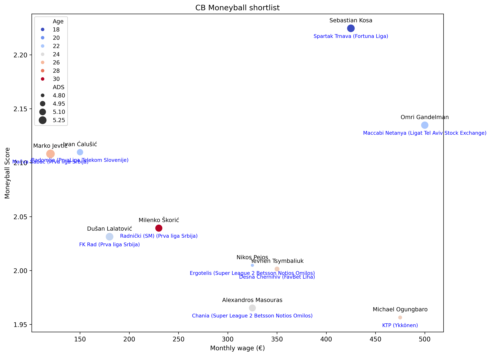

# FM22 Moneyball — Data Analysis from Football Manager 2022

This project explores player performance data extracted from Football Manager 2022.  
The idea is inspired by the Moneyball mindset.

---

## Notebooks

You'll find in the `notebooks/` folder the different study cases and analyses, including
Each notebook is self-contained and can be run independently after data preparation steps.

---

## How to run project

1. Clone the repo
2. Use a virtual env 
```bash
python -m venv .venv
source .venv/bin/activate  # or .venv\\Scripts\\activate on Windows
pip install -r requirements.txt
```
2. (bis) Or just locally
```bash
pip install -r requirements.txt
```
3. Convert the data file from .html to .csv
```bash
python scripts/data_conversion.py
```
4. Clean the data 
```bash 
python scripts/data_cleaning.py
```
5. Run analysis or open notebooks

---

## Example
[Here](notebooks/04_concrete_case.ipynb) is a 'realistic' case of Moneyball scouting. 

And an example of graph generated: 



## For more info about Moneyball 

### Moneyball resources
- **Moneyball: The Art of Winning an Unfair Game** — Michael Lewis (2003) 
 The foundational book that introduced the Moneyball concept, exploring how the Oakland Athletics used data analytics and unconventional thinking to compete with much wealthier teams.
- **Moneyball** — Bennett Miller (2011)
 The adapted movie. 

### Moneyball in football: real-world example
- **Brentford FC’s data-driven revolution**  
  Brentford is often cited as English football’s premier Moneyball club. With limited resources, they focus on recruiting undervalued young players using advanced analytics, then developing and selling them.

